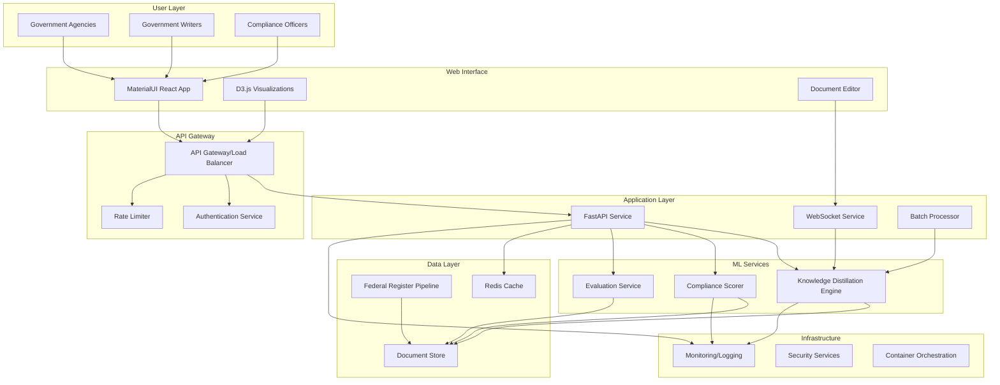

# Government Compliance System Architecture
**Agent**: SystemArchitect (agent_1757025907073_jkk8x7)  
**GitHub Issue**: [#1](https://github.com/michaeloboyle/legal-ai-demo/issues/1)

## Executive Summary

This document presents the production-ready system architecture for the AI-Powered Government Plain Language Compliance System, designed for federal agency deployment with FedRAMP-compatible security and real-time performance requirements.

## System Overview



## Core Components

### 1. User Interface Layer

**MaterialUI React Application**
- Government-compliant design system
- 508/WCAG accessibility standards
- Real-time document editor with live suggestions
- Responsive design for government devices

**D3.js Visualization Suite**
- Compliance score dashboards
- Readability improvement metrics
- Multi-agency performance analytics
- Real-time data binding

### 2. API Gateway & Security

**API Gateway (Kong/AWS API Gateway)**
```yaml
security:
  authentication:
    type: OAuth2/SAML
    provider: login.gov
    mfa: required
  
  authorization:
    rbac: enabled
    roles:
      - compliance_officer
      - government_writer
      - agency_admin
  
  rate_limiting:
    default: 1000/hour
    burst: 50/minute
  
  encryption:
    tls: 1.3
    data_at_rest: AES-256
```

### 3. Application Services

**FastAPI Core Service**
```python
# Core API Structure
app = FastAPI(
    title="Government Compliance API",
    version="1.0.0",
    docs_url="/api/docs"
)

@app.post("/api/v1/optimize-government-text")
async def optimize_document(
    request: DocumentRequest,
    user: GovernmentUser = Depends(authenticate_user),
    limiter: RateLimiter = Depends(get_rate_limiter)
) -> ComplianceResponse:
    # Real-time optimization with <2s SLA
    pass

@app.get("/api/v1/compliance-score/{document_id}")
async def get_compliance_score(
    document_id: str,
    user: GovernmentUser = Depends(authenticate_user)
) -> ComplianceScore:
    # Cached compliance scoring
    pass

@app.post("/api/v1/batch-optimize")
async def batch_optimize(
    documents: List[Document],
    background_tasks: BackgroundTasks
) -> BatchResponse:
    # Async batch processing for agencies
    pass
```

### 4. ML Services Architecture

**Knowledge Distillation Engine**
```python
class GovernmentKnowledgeDistillation:
    """
    Core ML service for legal accuracy preservation
    """
    def __init__(self):
        self.teacher_model = self._load_teacher_model()  # Legal accuracy
        self.student_model = self._load_student_model()  # Plain language
        self.cache = RedisCache()
    
    async def optimize(self, document: str) -> OptimizedDocument:
        # Check cache first
        cached = await self.cache.get(hash(document))
        if cached:
            return cached
        
        # Extract legal constraints
        legal_constraints = self.teacher_model.extract(document)
        
        # Generate simplified version
        simplified = self.student_model.generate(
            document=document,
            constraints=legal_constraints,
            target_grade=10
        )
        
        # Cache result
        await self.cache.set(hash(document), simplified, ttl=3600)
        
        return simplified
```

### 5. Data Pipeline Architecture

**Federal Register Data Pipeline**
```python
class FederalRegisterPipeline:
    """
    Scalable government document ingestion
    """
    def __init__(self):
        self.sources = [
            "https://www.federalregister.gov/api",
            "https://www.ecfr.gov/api",
            "https://api.regulations.gov"
        ]
        self.document_store = DocumentStore()
        self.preprocessor = GovernmentDocumentPreprocessor()
    
    async def ingest_documents(self):
        async with aiohttp.ClientSession() as session:
            for source in self.sources:
                documents = await self.fetch_documents(session, source)
                processed = await self.preprocessor.process_batch(documents)
                await self.document_store.save_batch(processed)
```

## Deployment Architecture

### Container Strategy

```dockerfile
# Multi-stage build for security and efficiency
FROM python:3.11-slim AS builder
WORKDIR /app
COPY requirements.txt .
RUN pip install --no-cache-dir -r requirements.txt

FROM python:3.11-slim
WORKDIR /app
COPY --from=builder /usr/local/lib/python3.11/site-packages /usr/local/lib/python3.11/site-packages
COPY . .

# Security hardening
RUN useradd -m -U govuser && chown -R govuser:govuser /app
USER govuser

EXPOSE 8000
CMD ["uvicorn", "main:app", "--host", "0.0.0.0", "--port", "8000"]
```

### Kubernetes Deployment

```yaml
apiVersion: apps/v1
kind: Deployment
metadata:
  name: compliance-api
  namespace: gov-compliance
spec:
  replicas: 3
  selector:
    matchLabels:
      app: compliance-api
  template:
    metadata:
      labels:
        app: compliance-api
    spec:
      containers:
      - name: api
        image: compliance-api:latest
        resources:
          requests:
            memory: "2Gi"
            cpu: "1000m"
          limits:
            memory: "4Gi"
            cpu: "2000m"
        env:
        - name: ENVIRONMENT
          value: "production"
        livenessProbe:
          httpGet:
            path: /health
            port: 8000
          initialDelaySeconds: 30
          periodSeconds: 10
---
apiVersion: v1
kind: Service
metadata:
  name: compliance-api-service
spec:
  selector:
    app: compliance-api
  ports:
  - port: 80
    targetPort: 8000
  type: LoadBalancer
```

## Performance Requirements

### Response Time SLAs
- **Document optimization**: <2 seconds (p95)
- **Compliance scoring**: <500ms (cached)
- **Batch processing**: <30 seconds for 100 documents
- **Dashboard refresh**: <1 second

### Scalability Targets
- **Concurrent users**: 10,000 government employees
- **Documents/day**: 100,000+
- **API requests/second**: 1,000 sustained, 5,000 burst
- **Storage**: 10TB document archive

## Security Architecture

### FedRAMP Compliance

**Security Controls Implementation**
```yaml
access_control:
  - AC-2: Account Management
  - AC-3: Access Enforcement  
  - AC-4: Information Flow Enforcement

audit_accountability:
  - AU-2: Audit Events
  - AU-3: Content of Audit Records
  - AU-4: Audit Storage Capacity

security_assessment:
  - CA-2: Security Assessments
  - CA-7: Continuous Monitoring

identification_authentication:
  - IA-2: Multi-Factor Authentication
  - IA-8: PIV Card Integration

system_communications:
  - SC-8: Transmission Confidentiality
  - SC-13: Cryptographic Protection
```

### Data Protection

```python
class DataProtection:
    """
    Government data protection implementation
    """
    def __init__(self):
        self.encryption = AES256Encryption()
        self.pii_detector = PIIDetector()
        self.audit_logger = AuditLogger()
    
    def protect_document(self, document: Document) -> ProtectedDocument:
        # Detect and mask PII
        masked = self.pii_detector.mask(document)
        
        # Encrypt at rest
        encrypted = self.encryption.encrypt(masked)
        
        # Audit trail
        self.audit_logger.log_access(document.id, user_context())
        
        return encrypted
```

## Monitoring & Observability

### Metrics Collection

```python
# Prometheus metrics
from prometheus_client import Counter, Histogram, Gauge

api_requests = Counter('api_requests_total', 'Total API requests')
optimization_duration = Histogram('optimization_duration_seconds', 'Document optimization duration')
compliance_score_gauge = Gauge('compliance_score', 'Current compliance score', ['agency'])
active_users = Gauge('active_users', 'Current active government users')

# Application metrics
@app.middleware("http")
async def track_metrics(request: Request, call_next):
    start_time = time.time()
    response = await call_next(request)
    
    api_requests.inc()
    optimization_duration.observe(time.time() - start_time)
    
    return response
```

### Logging Strategy

```python
import structlog

logger = structlog.get_logger()

# Structured logging for government compliance
logger.info(
    "document_optimized",
    user_id=user.id,
    agency=user.agency,
    document_id=document.id,
    original_grade_level=16.2,
    optimized_grade_level=9.8,
    compliance_score=0.94,
    processing_time_ms=1823
)
```

## Disaster Recovery & Business Continuity

### Backup Strategy
- **Real-time replication**: Multi-region database replication
- **Document archives**: Daily backups to government cloud storage
- **Model versions**: Versioned model storage with rollback capability
- **Configuration**: GitOps-based configuration management

### Recovery Objectives
- **RTO (Recovery Time Objective)**: 4 hours
- **RPO (Recovery Point Objective)**: 1 hour
- **Availability target**: 99.9% (8.76 hours downtime/year)

## Cost Optimization

### Resource Allocation
```yaml
development:
  instances: 1
  memory: 2GB
  storage: 100GB
  estimated_cost: $100/month

staging:
  instances: 2
  memory: 4GB
  storage: 500GB
  estimated_cost: $500/month

production:
  instances: 3-10 (auto-scaling)
  memory: 8GB per instance
  storage: 10TB
  estimated_cost: $2,000-5,000/month
```

## Success Metrics

### Technical KPIs
- API response time <2s (95th percentile)
- System availability >99.9%
- Zero security breaches
- <1% error rate

### Business KPIs  
- Document optimization throughput: 100,000/day
- Agency adoption rate: 50+ agencies in Year 1
- Compliance score improvement: Average +2 grades
- Cost savings: $10M+ in reduced training costs

## Implementation Timeline

**Phase 1: Foundation (Weeks 1-2)**
- Core API implementation
- Knowledge distillation integration
- Basic security controls

**Phase 2: Production Readiness (Weeks 3-4)**
- FedRAMP compliance implementation
- Performance optimization
- Monitoring and logging

**Phase 3: Agency Deployment (Weeks 5-6)**
- Government cloud deployment
- Agency onboarding
- Production monitoring

This architecture provides a robust, scalable, and secure foundation for the Government Plain Language Compliance System, meeting all federal requirements while delivering real-time performance for government users.